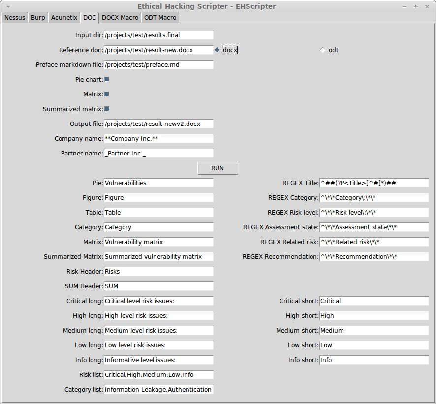

#EHScriptor

Ethical Hacking Scripter - GUI converter and docx/odt generator for ethical hacking.

Input formats:
- Nessus 
- Burp 
- Acunetx
- any markdown file

Output formats:
- docx
- odt

#Steps - How to use it

1. Create a docx with some default formatting (like headings, captions)
2. Convert to Nessus/Burp/Acunetix to markdown with EHScriptor
3. Manually edit the results (if needed)
4. Add findings like the converted ones
5. Convert to docx or odt with EHScriptor
6. Open result in office and click through the errors ;)
7. Run the macro (copy it from GUI)
8. Adjust the styles (numbering of "Headings" and "Source Code" style)
9. Done!

#Screenshots

#ChangeLog

- v0.1 - Initial release

#Requirements

##Linux packages:

    sudo apt-get install python3
    sudo apt-get install python3-easygui
    sudo apt-get install python3-yaml
    sudo apt-get install python3-setuptools
    sudo apt-get install libyaml-dev
    sudo apt-get install python3-dev
    sudo apt-get install libffi-dev
    sudo apt-get install pandoc

##Python3 packages:

    easy_install3 pip
    pip3 install pyyaml
    pip3 install lxml
    pip3 install pygal
    pip3 install cairosvg
    pip3 install cssselect
    pip3 install tinycss
    pip3 install html2text

#License

GNU GPL V2

